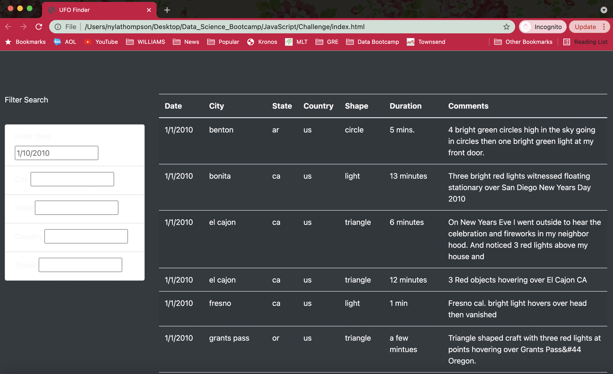

# UFO Analysis

## Overview of Project
In this analysis Javascript, HTML, and bootstrapping skills were used to create a table to organize UFO data stored as a JavaScript array, filter it based on certain criteria, and convert this data into a functional webpage. The html webpage includes an article, table of data to support findings, and filters to easily sift through the data.

## Results
As soon as someone opens the webpage they can see the header with a nasa picture and immediately start reading the article.

They can then scroll down and see the data on UFO sightings. On the left they can filter this data by date, city, state, country, or shape to see the sightings in which they care the most about. As you can see pictured below I wanted to filter by state where the state of the sighting was CA so I simply typed that into the State box. Multiple filters can also be used at once. An example of this can be seen in the screenshot below where I filter by a state where the state is CA and also by shape where the shape is triangle.

## Summary
One drawback of this webpage design is that once you filter the data there is no way to go back to the unfiltered data without refreshing the page. I would recommend implementing this change by maybe adding a button to reset filters. I would also reccommend expanding data to include a larger variety of dates and countries (all of the data is from 2010 and the only country is the US.
